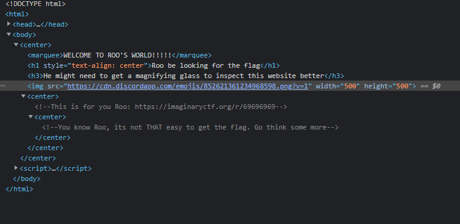

# Roos World (Web, 50 pts)

## Description

Somebody hid Roo's flag on his website. Roo really needs some help.

## Attachments

https://roos-world.chal.imaginaryctf.org/

## Solution

Upon clicking the link, we see a magnificent website:


Hmm. Per the advice, let's inspect it:



After being [rickrolled](https://imaginaryctf.org/r/69696969) by the link in the comment, we also notice a javascript snippet.


Well, I don't really know what that is, but running that on jsfiddle gives us the flag.


Going to the console tab works as well:


## Flag
```
ictf{1nsp3ct0r_r00_g0es_th0nk}
```

## ... but how does it all work?

*I don't have much experience with JS, so feel free to correct me if I'm wrong.*

I was curious as to how that translated to giving the flag, so I decided to try working it out.

Some things I learned that was central to this obfuscated code:

1. The [addition operator](https://tc39.es/ecma262/multipage/ecmascript-language-expressions.html#sec-addition-operator-plus) either does string concatenation or numeric addition; after coercing the operands to a primitive type, if one operand is a string, the other will be coerced into a string; else, it will try to do a numeric addition. When coercing to a primitive type, it will try to do the conversion to a number or a string in the order given by the argument `hint`; conversion to a number will be done by `valueOf`, and conversion to a string will be done by `toString`.
2. The `+` is also a [unary](https://developer.mozilla.org/en-US/docs/Web/JavaScript/Reference/Operators/Unary_plus) operator that converts the operand into a number.
3. The [logical NOT](https://tc39.es/ecma262/multipage/ecmascript-language-expressions.html#sec-logical-not-operator) operator will call [ToBoolean](https://tc39.es/ecma262/multipage/abstract-operations.html#sec-toboolean) on the operand, which returns `false` on `false`, `null`, `0`, `+0`, `-0`, `NaN`, `""`, or `undefined`, and `true` otherwise.
4. The [property accessor](https://developer.mozilla.org/en-US/docs/Web/JavaScript/Reference/Operators/Property_accessors) (`[]`)can access a property of an object. In this context, property includes methods:
    > It's typical when speaking of an object's properties to make a distinction between properties and methods. However, the property/method distinction is little more than a convention. A method is a property that can be called (for example, if it has a reference to a Function instance as its value).

    There are two notations - the dot notation and the bracket notation. It also coerces whatever's within the brackets to a string:

    > Property names are string or Symbol. Any other value, including a number, is coerced to a string.
5. The empty array `[]`, under the unary plus `+`, will result in `0` through the conversion of the array object to an empty string `""` to a value of `0`. A detailed explanation [here](https://stackoverflow.com/questions/3306453/why-an-empty-array-type-converts-to-zero).

With all these covered, let's try to decode little bit by bit in the beginning, and since things tend to repeat a lot, we can go faster later.

### First part

```
[][(![]+[])[+[]]+(![]+[])[!+[]+!+[]]+(![]+[])[+!+[]]+(!![]+[])[+[]]]
```

We'll separate this like so:

```
[]
[
    (![]+[])[+[]]
    +(![]+[])[!+[]+!+[]]
    +(![]+[])[+!+[]]
    +(!![]+[])[+[]]
]
```

The first `[]` is an empty array.

```
(![]+[])[+[]]
```

`![]` results in `false`, as `[]` is none of the things listed above (point 3) that returns `false` by `ToBoolean`. So `![]` is `!true` which is `false`.

Now we have `(false + [])[+[]]`. Since the addition operator will call `ToPrimitive` on the operands, and `[]` will result in an empty string `""`, the `false` will also be coerced into a string. So the result is `"false"[+[]]`.

`+[]`, as per the 5th point on the list, is `0`.

So this line is `"false"[0]`, which is `'f'`.

```
+(![]+[])[!+[]+!+[]]
```

The first part is `"false"`, as before.

Looking at `!+[]`, both `!` and `+` are unary operators. `+` will first operate on the `[]`, which is a 0. Doing `ToBoolean` on `0` results in `false`, so `!0` is `true`. Therefore, this line translates to `+"false"[true+true]`. Since both are primtive types and neither is a string, they are coerced into numbers. [`true` becomes `1`](https://tc39.es/ecma262/multipage/abstract-operations.html#sec-tonumber), so the result is `+"false"[2]`, which is `+'l'`.

```
+(![]+[])[+!+[]]
```

Similarly, this is `+"false"[1]`, or `+'a'`.

```
+(!![]+[])[+[]]
```

Since `![]` is `false`, `!![]` is `true`, and thus this line translates to `'+"true"[0]`, or `+'t'`

The result of all these combined is:

```
[]["flat"]
```

[`"flat"`](https://developer.mozilla.org/en-US/docs/Web/JavaScript/Reference/Global_Objects/Array/flat) is a method of an Array object. So this line returns `function flat() { [native code] }`, the function object.

On to a bigger snippet!

### Second Part

```
[([][(![]+[])[+[]]+(![]+[])[!+[]+!+[]]+(![]+[])[+!+[]]+(!![]+[])[+[]]]+[])[!+[]+!+[]+!+[]]+(!![]+[][(![]+[])[+[]]+(![]+[])[!+[]+!+[]]
+(![]+[])[+!+[]]+(!![]+[])[+[]]])[+!+[]+[+[]]]+([][[]]+[])[+!+[]]+(![]+[])[!+[]+!+[]+!+[]]+(!![]+[])[+[]]+(!![]+[])[+!+[]]
+([][[]]+[])[+[]]+([][(![]+[])[+[]]+(![]+[])[!+[]+!+[]]+(![]+[])[+!+[]]+(!![]+[])[+[]]]+[])[!+[]+!+[]+!+[]]+(!![]+[])[+[]]
+(!![]+[][(![]+[])[+[]]+(![]+[])[!+[]+!+[]]+(![]+[])[+!+[]]+(!![]+[])[+[]]])[+!+[]+[+[]]]+(!![]+[])[+!+[]]]
```

Let's convert all the `true` and `false` to make it a little easier to read this:

```
[([]["false"[+[]]+"false"[!+[]+!+[]]+"false"[+!+[]]+"true"[+[]]]+[])[!+[]+!+[]+!+[]]+(!![]+[]["false"[+[]]
+"false"[!+[]+!+[]]+"false"[+!+[]]+"true"[+[]]])[+!+[]+[+[]]]+([][[]]+[])[+!+[]]+"false"[!+[]+!+[]+!+[]]+"true"[+[]]
+"true"[+!+[]]+([][[]]+[])[+[]]+([]["false"[+[]]+"false"[!+[]+!+[]]+"false"[+!+[]]+"true"[+[]]]+[])[!+[]+!+[]+!+[]]
+"true"[+[]]+(!![]+[]["false"[+[]]+"false"[!+[]+!+[]]+"false"[+!+[]]+"true"[+[]]])[+!+[]+[+[]]]+"true"[+!+[]]]
```

and the index to a numeric value:

```
[([]["false"[0]+"false"[2]+"false"[1]+"true"[0]]+[])[3]+(!![]+[]["false"[0]+"false"[2]+"false"[1]+"true"[0]])[+!+[]+[+[]]]
+([][[]]+[])[1]+"false"[3]+"true"[0]+"true"[1]+([][[]]+[])[0]+([]["false"[0]+"false"[2]+"false"[1]+"true"[0]]+[])[3]
+"true"[0]+(!![]+[]["false"[0]+"false"[2]+"false"[1]+"true"[0]])[+!+[]+[+[]]]+"true"[1]]
```

We'll separate them by lines for readability's sake, and also clean up things like `"false"[1]` into single characters.

```
[([]["f"+"l"+"a"+"t"]+[])[3]
+(!![]+[]["f"+"l"+"a"+"t"])[+!+[]+[+[]]]
+([][[]]+[])[1]+"s"+"t"+"r"+([][[]]+[])[0]
+([]["f"+"l"+"a"+"t"]+[])[3]
+"t"
+(!![]+[]["f"+"l"+"a"+"t"])[+!+[]+[+[]]]
+"r"]
```

Some new things appeared, such as:

```
[][[]]+[]
```

The property accessor will coerce the inner `[]` to a string, so this is `[][""]+[]`. The Array object does not have the property named `""`, making it will evaluate to `undefined`. We now have `undefined+[]`; because `[]` after `ToPrimitive` operation will become an empty string, `undefined` will be coerced to a string. The result is `"undefined"`. 

```
[+!+[]+[+[]]]
```

`+!+[]` is `1`; `+[]` is 0; therefore, this is `[1 + [0]]`. In this addition, `[0]` goes through `ToPrimitive`; while the array object does not have a `valueOf` method, it does have a `toString` method, which will concatenate all the elements as a string, joined with `,`. Consequently, `[0]` will become `"0"`. Since one of the operands is a string, the result is `["10"]`.

Now the snippet is:

```
[([]["flat"]+[])[3]
+(true+[]["flat"])["10"]
+("undefined")[1]+"s"+"t"+"r"+("undefined")[0]
+([]["flat"]+[])[3]
+"t"
+(true+[]["flat"])["10"]
+"r"]
```

As discussed earlier, `[]["flat"]` is a function object `function flat() { [native code] }`. Function objects also don't have a `valueOf` method, but do have a [`toString` method](https://developer.mozilla.org/en-US/docs/Web/JavaScript/Reference/Global_Objects/Function/toString) that returns `"function FunctionName() { [native code] }"`, `[native code]` being the code inside the function.

So `[]["flat"]+[]` will be the string `"function flat() { [native code] }"`, and `true+[]["flat"]` will be the string `"truefunction flat() { [native code] }"`.

Using these, the result of this part is `["constructor"]`.

### Checkpoint Summary

We now have some useful parts that are used a lot. Let's summarize it here so that we can use it later:

```
[([][(![]+[])[+[]]+(![]+[])[!+[]+!+[]]+(![]+[])[+!+[]]+(!![]+[])[+[]]]+[])[!+[]+!+[]+!+[]]+(!![]+[][(![]+[])[+[]]+(![]+[])[!+[]+!+[]]+(![]+[])[+!+[]]+(!![]+[])[+[]]])[+!+[]+[+[]]]+([][[]]+[])[+!+[]]+(![]+[])[!+[]+!+[]+!+[]]+(!![]+[])[+[]]+(!![]+[])[+!+[]]+([][[]]+[])[+[]]+([][(![]+[])[+[]]+(![]+[])[!+[]+!+[]]+(![]+[])[+!+[]]+(!![]+[])[+[]]]+[])[!+[]+!+[]+!+[]]+(!![]+[])[+[]]+(!![]+[][(![]+[])[+[]]+(![]+[])[!+[]+!+[]]+(![]+[])[+!+[]]+(!![]+[])[+[]]])[+!+[]+[+[]]]+(!![]+[])[+!+[]]]
==> ["constructor"]

!![]+[][(![]+[])[+[]]+(![]+[])[!+[]+!+[]]+(![]+[])[+!+[]]+(!![]+[])[+[]]]
==> "truefunction flat() { [native code] }"

[][(![]+[])[+[]]+(![]+[])[!+[]+!+[]]+(![]+[])[+!+[]]+(!![]+[])[+[]]]+[]
==> "function flat() { [native code] }"

(![]+[])[+[]]+(![]+[])[!+[]+!+[]]+(![]+[])[+!+[]]+(!![]+[])[+[]]
==> "flat"

([][[]]+[]) ==> "undefined"
(![]+[])    ==> "false"
(!![]+[])   ==> "true"

[][[]] ==> undefined
!![]   ==> true
![]    ==> false
```

### Third Part

```
((!![]+[])[+!+[]]+(!![]+[])[!+[]+!+[]+!+[]]+(!![]+[])[+[]]+([][[]]+[])[+[]]+(!![]+[])[+!+[]]+([][[]]+[])[+!+[]]+(+[![]]+[][(![]+[])[+[]]+(![]+[])[!+[]+!+[]]+(![]+[])[+!+[]]+(!![]+[])[+[]]])[+!+[]+[+!+[]]]+(!![]+[])[!+[]+!+[]+!+[]]+(+(!+[]+!+[]+!+[]+[+!+[]]))[(!![]+[])[+[]]+(!![]+[][(![]+[])[+[]]+(![]+[])[!+[]+!+[]]+(![]+[])[+!+[]]+(!![]+[])[+[]]])[+!+[]+[+[]]]+([]+[])[([][(![]+[])[+[]]+(![]+[])[!+[]+!+[]]+(![]+[])[+!+[]]+(!![]+[])[+[]]]+[])[!+[]+!+[]+!+[]]+(!![]+[][(![]+[])[+[]]+(![]+[])[!+[]+!+[]]+(![]+[])[+!+[]]+(!![]+[])[+[]]])[+!+[]+[+[]]]+([][[]]+[])[+!+[]]+(![]+[])[!+[]+!+[]+!+[]]+(!![]+[])[+[]]+(!![]+[])[+!+[]]+([][[]]+[])[+[]]+([][(![]+[])[+[]]+(![]+[])[!+[]+!+[]]+(![]+[])[+!+[]]+(!![]+[])[+[]]]+[])[!+[]+!+[]+!+[]]+(!![]+[])[+[]]+(!![]+[][(![]+[])[+[]]+(![]+[])[!+[]+!+[]]+(![]+[])[+!+[]]+(!![]+[])[+[]]])[+!+[]+[+[]]]+(!![]+[])[+!+[]]][([][[]]+[])[+!+[]]+(![]+[])[+!+[]]+((+[])[([][(![]+[])[+[]]+(![]+[])[!+[]+!+[]]+(![]+[])[+!+[]]+(!![]+[])[+[]]]+[])[!+[]+!+[]+!+[]]+(!![]+[][(![]+[])[+[]]+(![]+[])[!+[]+!+[]]+(![]+[])[+!+[]]+(!![]+[])[+[]]])[+!+[]+[+[]]]+([][[]]+[])[+!+[]]+(![]+[])[!+[]+!+[]+!+[]]+(!![]+[])[+[]]+(!![]+[])[+!+[]]+([][[]]+[])[+[]]+([][(![]+[])[+[]]+(![]+[])[!+[]+!+[]]+(![]+[])[+!+[]]+(!![]+[])[+[]]]+[])[!+[]+!+[]+!+[]]+(!![]+[])[+[]]+(!![]+[][(![]+[])[+[]]+(![]+[])[!+[]+!+[]]+(![]+[])[+!+[]]+(!![]+[])[+[]]])[+!+[]+[+[]]]+(!![]+[])[+!+[]]]+[])[+!+[]+[+!+[]]]+(!![]+[])[!+[]+!+[]+!+[]]]](!+[]+!+[]+!+[]+[!+[]+!+[]])+(![]+[])[+!+[]]+(![]+[])[!+[]+!+[]])()
```

Replacing everything with what we know:

```
("true"[+!+[]]+"true"[!+[]+!+[]+!+[]]+"true"[+[]]+"undefined"[+[]]+"true"[+!+[]]+"undefined"[+!+[]]+(+[![]]+[]["flat"])[+!+[]+[+!+[]]]
+"true"[!+[]+!+[]+!+[]]+(+(!+[]+!+[]+!+[]+[+!+[]]))["true"[+[]]+("truefunction flat() {...}")[+!+[]+[+[]]]
+([]+[])["constructor"]["undefined"[+!+[]]+"false"[+!+[]]+((+[])["constructor"]+[])[+!+[]+[+!+[]]]
+"true"[!+[]+!+[]+!+[]]]](!+[]+!+[]+!+[]+[!+[]+!+[]])+"false"[+!+[]]+"false"[!+[]+!+[]])()
```

Calculating indices:

```
("true"[1]+"true"[3]+"true"[0]+"undefined"[0]+"true"[1]+"undefined"[1]+(+[![]]+[]["flat"])["11"]
+"true"[3]+(31)["true"[0]+("truefunction flat() {...}")["10"]+([]+[])["constructor"]["undefined"[1]+"false"[1]
+((0)["constructor"]+[])["11"]+"true"[3]]]("32")+"false"[1]+"false"[2])()
```

Concatenating strings:

```
("return"
+(+[![]]+[]["flat"])["11"]
+"e"
+(31)["to"+([]+[])["constructor"]["na"+((0)["constructor"]+[])["11"]+"e"]]("32")
+"al")()
```

In the second line
```
+[![]]+[]["flat"])["11"]
```

`[![]]` is `[false]`, which goes through `ToNumber`. `[false]` is an Array object, and needs to become a primitive beforehand. `ToPrimitive` will result in the string `"false"`, which cannot be converted to a number ([`StringToNumber`](https://tc39.es/ecma262/multipage/abstract-operations.html#sec-stringtonumber)) and will return `NaN`. The result is therefore `["NaNfunction flat() {...}"[11]]`, which is `" "`.

The fourth line:
```
(31)["to"+([]+[])["constructor"]["na"+((0)["constructor"]+[])["11"]+"e"]]("32")
```

Looking at this specifically:
```
["na"+((0)["constructor"]+[])["11"]+"e"]
```

`(0)["constructor"]` calls the constructor for the [`Number`](https://developer.mozilla.org/en-US/docs/Web/JavaScript/Reference/Global_Objects/Number) object, resulting in `function Number() {...}`. This whole snippet therefore is `["name"]`. Now:
```
(31)["to"+([]+[])["constructor"]["name"]]("32")
```

Because `[]+[]` is the string `""`, we're getting the name of the constructor function of String object, which is `"String"`. We now have `(31)["toString"]("32")`; the argument `32` given to `toString` for the Number object `31` is the [radix](https://developer.mozilla.org/en-US/docs/Web/JavaScript/Reference/Global_Objects/Number/toString#parameters), or the base in which the number will be converted to. 31 in base 32 is `v`.

Thus, the third part is `("return eval")()`.

### Final Part

```
([][(![]+[])[+[]]+(![]+[])[!+[]+!+[]]+(![]+[])[+!+[]]+(!![]+[])[+[]]][([][(![]+[])[+[]]+(![]+[])[!+[]+!+[]]+(![]+[])[+!+[]]+(!![]+[])[+[]]]+[])[!+[]+!+[]+!+[]]+(!![]+[][(![]+[])[+[]]+(![]+[])[!+[]+!+[]]+(![]+[])[+!+[]]+(!![]+[])[+[]]])[+!+[]+[+[]]]+([][[]]+[])[+!+[]]+(![]+[])[!+[]+!+[]+!+[]]+(!![]+[])[+[]]+(!![]+[])[+!+[]]+([][[]]+[])[+[]]+([][(![]+[])[+[]]+(![]+[])[!+[]+!+[]]+(![]+[])[+!+[]]+(!![]+[])[+[]]]+[])[!+[]+!+[]+!+[]]+(!![]+[])[+[]]+(!![]+[][(![]+[])[+[]]+(![]+[])[!+[]+!+[]]+(![]+[])[+!+[]]+(!![]+[])[+[]]])[+!+[]+[+[]]]+(!![]+[])[+!+[]]]((!![]+[])[+!+[]]+(!![]+[])[!+[]+!+[]+!+[]]+(!![]+[])[+[]]+([][[]]+[])[+[]]+(!![]+[])[+!+[]]+([][[]]+[])[+!+[]]+([]+[])[(![]+[])[+[]]+(!![]+[][(![]+[])[+[]]+(![]+[])[!+[]+!+[]]+(![]+[])[+!+[]]+(!![]+[])[+[]]])[+!+[]+[+[]]]+([][[]]+[])[+!+[]]+(!![]+[])[+[]]+([][(![]+[])[+[]]+(![]+[])[!+[]+!+[]]+(![]+[])[+!+[]]+(!![]+[])[+[]]]+[])[!+[]+!+[]+!+[]]+(!![]+[][(![]+[])[+[]]+(![]+[])[!+[]+!+[]]+(![]+[])[+!+[]]+(!![]+[])[+[]]])[+!+[]+[+[]]]+(![]+[])[!+[]+!+[]]+(!![]+[][(![]+[])[+[]]+(![]+[])[!+[]+!+[]]+(![]+[])[+!+[]]+(!![]+[])[+[]]])[+!+[]+[+[]]]+(!![]+[])[+!+[]]]()[+!+[]+[!+[]+!+[]]]+((!![]+[])[+[]]+[+!+[]]+[!+[]+!+[]+!+[]+!+[]]+[!+[]+!+[]+!+[]]+(!![]+[])[+[]]+[+!+[]]+[!+[]+!+[]+!+[]+!+[]+!+[]]+[!+[]+!+[]+!+[]+!+[]+!+[]+!+[]+!+[]]+([][[]]+[])[+!+[]]+(![]+[])[!+[]+!+[]+!+[]]+(!![]+[])[+[]]+[+!+[]]+[!+[]+!+[]+!+[]+!+[]+!+[]]+[!+[]+!+[]+!+[]+!+[]+!+[]+!+[]+!+[]]+(![]+[])[!+[]+!+[]]+(!![]+[])[!+[]+!+[]+!+[]]+(+(+!+[]+[+!+[]]+(!![]+[])[!+[]+!+[]+!+[]]+[!+[]+!+[]]+[+[]])+[])[+!+[]]+(![]+[])[!+[]+!+[]]+(!![]+[])[+[]]+[+!+[]]+[!+[]+!+[]+!+[]+!+[]+!+[]]+[!+[]+!+[]+!+[]+!+[]+!+[]+!+[]+!+[]]+(!![]+[])[+[]]+[+!+[]]+[!+[]+!+[]+!+[]+!+[]]+[!+[]+!+[]+!+[]+!+[]+!+[]+!+[]+!+[]]+(!![]+[])[+[]]+[!+[]+!+[]+!+[]+!+[]+!+[]]+[+[]]+(![]+[])[+!+[]]+(!![]+[])[+[]]+[+!+[]]+[!+[]+!+[]+!+[]+!+[]+!+[]+!+[]]+[!+[]+!+[]+!+[]+!+[]]+(!![]+[])[+[]]+[+!+[]]+[!+[]+!+[]+!+[]+!+[]+!+[]]+[!+[]+!+[]+!+[]+!+[]+!+[]+!+[]+!+[]]+(!![]+[])[+[]]+[+!+[]]+[!+[]+!+[]+!+[]+!+[]]+[!+[]+!+[]]+(!![]+[])[+[]]+[!+[]+!+[]+!+[]+!+[]+!+[]]+[+[]]+(!![]+[])[+[]]+[!+[]+!+[]+!+[]+!+[]]+[!+[]+!+[]]+(![]+[])[+!+[]]+(!![]+[])[+[]]+[+!+[]]+[!+[]+!+[]]+[!+[]+!+[]+!+[]+!+[]+!+[]+!+[]+!+[]]+(+[![]]+[])[+[]]+[+[]]+(!![]+[])[+[]]+[+!+[]]+[!+[]+!+[]+!+[]]+[!+[]+!+[]]+([][[]]+[])[+!+[]]+(![]+[])[!+[]+!+[]+!+[]]+(!![]+[])[+[]]+[+!+[]]+[!+[]+!+[]+!+[]+!+[]+!+[]+!+[]+!+[]]+[+[]]+(!![]+[])[+[]]+[+!+[]]+[!+[]+!+[]+!+[]+!+[]]+[!+[]+!+[]]+([][[]]+[])[+!+[]]+(+[![]]+[])[+[]]+(!![]+[])[+[]]+[+!+[]]+[!+[]+!+[]+!+[]+!+[]+!+[]+!+[]]+[!+[]+!+[]+!+[]+!+[]+!+[]+!+[]+!+[]]+(!![]+[])[+[]]+[+!+[]]+[+!+[]]+[!+[]+!+[]+!+[]+!+[]+!+[]]+[!+[]+!+[]]+(+[![]]+[])[+[]]+[+[]]+(!![]+[])[+[]]+[+!+[]]+[+!+[]]+[!+[]+!+[]+!+[]+!+[]+!+[]]+(!![]+[])[+[]]+[+!+[]]+[+!+[]]+[+[]]+(!![]+[])[+[]]+[+!+[]]+[+!+[]]+[!+[]+!+[]]+(![]+[])[+[]]+(!![]+[])[+[]]+[+!+[]]+[!+[]+!+[]+!+[]+!+[]]+[!+[]+!+[]+!+[]]+(!![]+[])[+[]]+[+!+[]]+[!+[]+!+[]+!+[]+!+[]+!+[]]+[!+[]+!+[]]+(!![]+[])[+[]]+[+!+[]]+[+[]]+[+!+[]]+(!![]+[])[+[]]+[+!+[]]+[!+[]+!+[]+!+[]+!+[]+!+[]+!+[]]+[!+[]+!+[]+!+[]+!+[]+!+[]+!+[]+!+[]]+(!![]+[])[+[]]+[+!+[]]+[!+[]+!+[]+!+[]]+[+[]]+[!+[]+!+[]]+(!![]+[])[+[]]+[+!+[]]+[!+[]+!+[]+!+[]+!+[]]+[!+[]+!+[]+!+[]]+(!![]+[])[+[]]+[+!+[]]+[!+[]+!+[]+!+[]+!+[]+!+[]+!+[]]+[!+[]+!+[]+!+[]+!+[]+!+[]+!+[]+!+[]]+(!![]+[])[+[]]+[+!+[]]+[!+[]+!+[]+!+[]]+[!+[]+!+[]]+(!![]+[])[+[]]+[+!+[]]+[!+[]+!+[]+!+[]]+[+[]]+(+[![]]+[])[+[]]+(![]+[])[+[]]+([][[]]+[])[!+[]+!+[]]+(!![]+[])[+[]]+[+!+[]]+[+[]]+[!+[]+!+[]+!+[]+!+[]+!+[]+!+[]+!+[]]+(!![]+[])[+[]]+[+!+[]]+[!+[]+!+[]+!+[]+!+[]]+[!+[]+!+[]+!+[]+!+[]+!+[]+!+[]+!+[]]+(!![]+[])[+[]]+[+!+[]]+[!+[]+!+[]+!+[]+!+[]+!+[]+!+[]]+[!+[]+!+[]+!+[]+!+[]+!+[]+!+[]+!+[]]+(!![]+[])[+[]]+[+!+[]]+[!+[]+!+[]+!+[]+!+[]]+[!+[]+!+[]]+(!![]+[])[+[]]+[+!+[]]+[!+[]+!+[]+!+[]+!+[]+!+[]]+[!+[]+!+[]+!+[]+!+[]+!+[]]+(!![]+[])[+[]]+[+!+[]]+[!+[]+!+[]+!+[]+!+[]+!+[]+!+[]]+[!+[]+!+[]+!+[]+!+[]]+[!+[]+!+[]+!+[]+!+[]+!+[]+!+[]+!+[]+!+[]+!+[]]+(!![]+[])[+[]]+[!+[]+!+[]+!+[]+!+[]]+[!+[]+!+[]]+(!![]+[])[+[]]+[!+[]+!+[]+!+[]+!+[]+!+[]]+[+!+[]]+(!![]+[])[+[]]+[!+[]+!+[]+!+[]+!+[]+!+[]]+[+!+[]]+(!![]+[])[+[]]+[!+[]+!+[]+!+[]+!+[]+!+[]+!+[]+!+[]]+[!+[]+!+[]+!+[]])[(![]+[])[!+[]+!+[]+!+[]]+(+(!+[]+!+[]+[+!+[]]+[+!+[]]))[(!![]+[])[+[]]+(!![]+[][(![]+[])[+[]]+(![]+[])[!+[]+!+[]]+(![]+[])[+!+[]]+(!![]+[])[+[]]])[+!+[]+[+[]]]+([]+[])[([][(![]+[])[+[]]+(![]+[])[!+[]+!+[]]+(![]+[])[+!+[]]+(!![]+[])[+[]]]+[])[!+[]+!+[]+!+[]]+(!![]+[][(![]+[])[+[]]+(![]+[])[!+[]+!+[]]+(![]+[])[+!+[]]+(!![]+[])[+[]]])[+!+[]+[+[]]]+([][[]]+[])[+!+[]]+(![]+[])[!+[]+!+[]+!+[]]+(!![]+[])[+[]]+(!![]+[])[+!+[]]+([][[]]+[])[+[]]+([][(![]+[])[+[]]+(![]+[])[!+[]+!+[]]+(![]+[])[+!+[]]+(!![]+[])[+[]]]+[])[!+[]+!+[]+!+[]]+(!![]+[])[+[]]+(!![]+[][(![]+[])[+[]]+(![]+[])[!+[]+!+[]]+(![]+[])[+!+[]]+(!![]+[])[+[]]])[+!+[]+[+[]]]+(!![]+[])[+!+[]]][([][[]]+[])[+!+[]]+(![]+[])[+!+[]]+((+[])[([][(![]+[])[+[]]+(![]+[])[!+[]+!+[]]+(![]+[])[+!+[]]+(!![]+[])[+[]]]+[])[!+[]+!+[]+!+[]]+(!![]+[][(![]+[])[+[]]+(![]+[])[!+[]+!+[]]+(![]+[])[+!+[]]+(!![]+[])[+[]]])[+!+[]+[+[]]]+([][[]]+[])[+!+[]]+(![]+[])[!+[]+!+[]+!+[]]+(!![]+[])[+[]]+(!![]+[])[+!+[]]+([][[]]+[])[+[]]+([][(![]+[])[+[]]+(![]+[])[!+[]+!+[]]+(![]+[])[+!+[]]+(!![]+[])[+[]]]+[])[!+[]+!+[]+!+[]]+(!![]+[])[+[]]+(!![]+[][(![]+[])[+[]]+(![]+[])[!+[]+!+[]]+(![]+[])[+!+[]]+(!![]+[])[+[]]])[+!+[]+[+[]]]+(!![]+[])[+!+[]]]+[])[+!+[]+[+!+[]]]+(!![]+[])[!+[]+!+[]+!+[]]]](!+[]+!+[]+!+[]+[+!+[]])[+!+[]]+(![]+[])[!+[]+!+[]]+([![]]+[][[]])[+!+[]+[+[]]]+(!![]+[])[+[]]]((!![]+[])[+[]])[([][(!![]+[])[!+[]+!+[]+!+[]]+([][[]]+[])[+!+[]]+(!![]+[])[+[]]+(!![]+[])[+!+[]]+([![]]+[][[]])[+!+[]+[+[]]]+(!![]+[])[!+[]+!+[]+!+[]]+(![]+[])[!+[]+!+[]+!+[]]]()+[])[!+[]+!+[]+!+[]]+(!![]+[][(![]+[])[+[]]+(![]+[])[!+[]+!+[]]+(![]+[])[+!+[]]+(!![]+[])[+[]]])[+!+[]+[+[]]]+([![]]+[][[]])[+!+[]+[+[]]]+([][[]]+[])[+!+[]]](([][(![]+[])[+[]]+(![]+[])[!+[]+!+[]]+(![]+[])[+!+[]]+(!![]+[])[+[]]][([][(![]+[])[+[]]+(![]+[])[!+[]+!+[]]+(![]+[])[+!+[]]+(!![]+[])[+[]]]+[])[!+[]+!+[]+!+[]]+(!![]+[][(![]+[])[+[]]+(![]+[])[!+[]+!+[]]+(![]+[])[+!+[]]+(!![]+[])[+[]]])[+!+[]+[+[]]]+([][[]]+[])[+!+[]]+(![]+[])[!+[]+!+[]+!+[]]+(!![]+[])[+[]]+(!![]+[])[+!+[]]+([][[]]+[])[+[]]+([][(![]+[])[+[]]+(![]+[])[!+[]+!+[]]+(![]+[])[+!+[]]+(!![]+[])[+[]]]+[])[!+[]+!+[]+!+[]]+(!![]+[])[+[]]+(!![]+[][(![]+[])[+[]]+(![]+[])[!+[]+!+[]]+(![]+[])[+!+[]]+(!![]+[])[+[]]])[+!+[]+[+[]]]+(!![]+[])[+!+[]]]((!![]+[])[+!+[]]+(!![]+[])[!+[]+!+[]+!+[]]+(!![]+[])[+[]]+([][[]]+[])[+[]]+(!![]+[])[+!+[]]+([][[]]+[])[+!+[]]+(![]+[+[]])[([![]]+[][[]])[+!+[]+[+[]]]+(!![]+[])[+[]]+(![]+[])[+!+[]]+(![]+[])[!+[]+!+[]]+([![]]+[][[]])[+!+[]+[+[]]]+([][(![]+[])[+[]]+(![]+[])[!+[]+!+[]]+(![]+[])[+!+[]]+(!![]+[])[+[]]]+[])[!+[]+!+[]+!+[]]+(![]+[])[!+[]+!+[]+!+[]]]()[+!+[]+[+[]]]+![]+(![]+[+[]])[([![]]+[][[]])[+!+[]+[+[]]]+(!![]+[])[+[]]+(![]+[])[+!+[]]+(![]+[])[!+[]+!+[]]+([![]]+[][[]])[+!+[]+[+[]]]+([][(![]+[])[+[]]+(![]+[])[!+[]+!+[]]+(![]+[])[+!+[]]+(!![]+[])[+[]]]+[])[!+[]+!+[]+!+[]]+(![]+[])[!+[]+!+[]+!+[]]]()[+!+[]+[+[]]])()[([][(![]+[])[+[]]+(![]+[])[!+[]+!+[]]+(![]+[])[+!+[]]+(!![]+[])[+[]]]+[])[!+[]+!+[]+!+[]]+(!![]+[][(![]+[])[+[]]+(![]+[])[!+[]+!+[]]+(![]+[])[+!+[]]+(!![]+[])[+[]]])[+!+[]+[+[]]]+([][[]]+[])[+!+[]]+(![]+[])[!+[]+!+[]+!+[]]+(!![]+[])[+[]]+(!![]+[])[+!+[]]+([][[]]+[])[+[]]+([][(![]+[])[+[]]+(![]+[])[!+[]+!+[]]+(![]+[])[+!+[]]+(!![]+[])[+[]]]+[])[!+[]+!+[]+!+[]]+(!![]+[])[+[]]+(!![]+[][(![]+[])[+[]]+(![]+[])[!+[]+!+[]]+(![]+[])[+!+[]]+(!![]+[])[+[]]])[+!+[]+[+[]]]+(!![]+[])[+!+[]]]((![]+[+[]])[([![]]+[][[]])[+!+[]+[+[]]]+(!![]+[])[+[]]+(![]+[])[+!+[]]+(![]+[])[!+[]+!+[]]+([![]]+[][[]])[+!+[]+[+[]]]+([][(![]+[])[+[]]+(![]+[])[!+[]+!+[]]+(![]+[])[+!+[]]+(!![]+[])[+[]]]+[])[!+[]+!+[]+!+[]]+(![]+[])[!+[]+!+[]+!+[]]]()[+!+[]+[+[]]])+[])[+!+[]])+([]+[])[(![]+[])[+[]]+(!![]+[][(![]+[])[+[]]+(![]+[])[!+[]+!+[]]+(![]+[])[+!+[]]+(!![]+[])[+[]]])[+!+[]+[+[]]]+([][[]]+[])[+!+[]]+(!![]+[])[+[]]+([][(![]+[])[+[]]+(![]+[])[!+[]+!+[]]+(![]+[])[+!+[]]+(!![]+[])[+[]]]+[])[!+[]+!+[]+!+[]]+(!![]+[][(![]+[])[+[]]+(![]+[])[!+[]+!+[]]+(![]+[])[+!+[]]+(!![]+[])[+[]]])[+!+[]+[+[]]]+(![]+[])[!+[]+!+[]]+(!![]+[][(![]+[])[+[]]+(![]+[])[!+[]+!+[]]+(![]+[])[+!+[]]+(!![]+[])[+[]]])[+!+[]+[+[]]]+(!![]+[])[+!+[]]]()[+!+[]+[!+[]+!+[]]])())
```

The result after converting basic things and cleaning up strings:

```
([]["flat"]["constructor"]("return"+("")["fontcolor"]()["12"]
+("t143t157nst157le.lt157t147t50at164t157t142t50t42at127N0t132nst170t142nNt167t1152N0t115t110t112ft143t152t101t167t1302t143t167t132t130Nfdt107t147t167t142t155t1649t42t51t51t73")
["s"+(211)["toString"](31)[1]+"lit"]("t")[([]["entries"]()+[])[3]+"oin"]
(([]["flat"]["constructor"]("return"+("false0")["italics"]()["10"]+![]+("false0")["italics"]()["10"])()["constructor"](("false0")["italics"]()["10"])+[])[1])
+("")["fontcolor"]()["12"])())
```

The [`fontcolor`](https://developer.mozilla.org/en-US/docs/Web/JavaScript/Reference/Global_Objects/String/fontcolor) method for strings returns a string containing `<font>` html element; so `("")["fontcolor"]()` returns `"<font color="undefined"></font>"`. Index 12 of that string is `"`.

We'll ignore the strange string in the middle for now, but it's worth mentioning how `.` is produced.

After simplifying the numbers, `(+(1+[1]+"e"+[2]+[0])+[])[1]` is the snippet that results in `.`; this is `(+"11e20"+[])`. JS accepts scientific notations, and will display numbers greater than or equal to `1e21` in it. `+"11e20"` results in `1.1e21`, so the snippet `(+(1+[1]+"e"+[2]+[0])+[])[1]` takes index 1 of string `"1.1e21"`, which is `.`.

In the next part, `(211)["toString"](31)[1]` will convert `211` to a base-31 string, which is `"6p"`. Index 1 of this string is `'p'`.

`("false0")["italics"]()["10"]`: the [`italics`](https://developer.mozilla.org/en-US/docs/Web/JavaScript/Reference/Global_Objects/String/italics) method returns a string containing an `<i>` HTML element. This one returns `"<i>false0</i>"`, the 10th index of which is `/`.

`[]["entries"]()` calls the [`entries`](https://developer.mozilla.org/en-US/docs/Web/JavaScript/Reference/Global_Objects/Array/entries) method for the array, which returns an Array Iterator object. The iterator object seems to inherits the [`toString` method](https://developer.mozilla.org/en-US/docs/Web/JavaScript/Reference/Global_Objects/Object/toString) from the `Object` class, which returns `[object type]` - in this case, `[object Array Iterator]`. Index 3 of the string is `'j'`.

The snippet
```
[]["flat"]["constructor"]("return"+"/"+![]+"/")()
```

is the function
```
function anonymous() {
    return/false/
}
```

in which the return value is `/false/` - a [`RegExp object`](https://developer.mozilla.org/en-US/docs/Web/JavaScript/Reference/Global_Objects/RegExp). This has a constructor [`RegExp()`](https://developer.mozilla.org/en-US/docs/Web/JavaScript/Reference/Global_Objects/RegExp/RegExp) that takes in a string literal or another `RegExp` object as a pattern, and returns a `RegExp` object.

So this
```
[]["flat"]["constructor"]("return"+"/"+![]+"/")()["constructor"]("/")
```

is equivalently
```
RegExp("/")
```

which returns a `RegExp` object with pattern `/`. `RegExp` object has a [`toString` method](https://developer.mozilla.org/en-US/docs/Web/JavaScript/Reference/Global_Objects/RegExp/toString), which returns a string representing the regular expression. So the snippet above will return `"/\//"`. Index 1 of this string is `\`.

Now we have:
```
([]["flat"]["constructor"]("return"+'"'+("t143t157nst157le.lt157t147t50at164t157t142t50t42at127N0t132nst170t142nNt167t1152N0t115t110t112ft143t152t101t167t1302t143t167t132t130Nfdt107t147t167t142t155t1649t42t51t51t73")["split"]('t')["join"](`\`)+'"')())
```

So we're calling `"t143t157nst157le.lt157t147t50at164t157t142t50t42at127N0t132nst170t142nNt167t1152N0t115t110t112ft143t152t101t167t1302t143t167t132t130Nfdt107t147t167t142t155t1649t42t51t51t73".split('t').join('\')`, which will replace all `t` with `\` as follows:
```
\143\157ns\157le.l\157\147\50a\164\157\142\50\42a\127N0\132ns\170\142nN\167\1152N0\115\110\112f\143\152\101\167\1302\143\167\132\130Nfd\107\147\167\142\155\1649\42\51\51\73\"
```

These are octal escape sequences, which is [deprecated as of ECMAScript 5](http://es5.github.io/B.html#B.1) but still can be used outside of strict mode. The string, using ascii, translates to `"console.log(atob(\&quot;aWN0ZnsxbnNwM2N0MHJfcjAwX2cwZXNfdGgwbmt9\&quot;));"`. [`atob`](https://developer.mozilla.org/en-US/docs/Web/API/WindowOrWorkerGlobalScope/atob) is a function that decodes a base64-encoded string, so it will decode `"aWN0ZnsxbnNwM2N0MHJfcjAwX2cwZXNfdGgwbmt9"`. Checking via an [online decoder](https://www.base64decode.org/), it does indeed give the flag `ictf{1nsp3ct0r_r00_g0es_th0nk}`. So the last part calls a function that returns `"console.log(atob(\&quot;aWN0ZnsxbnNwM2N0MHJfcjAwX2cwZXNfdGgwbmt9\&quot;));"`.

## Putting it all together

Combining all the parts together, we have:

- First Part: `[]["flat"]`
- Second Part: `["constructor"]`
- Third Part: `("return eval")()`
- Last Part: `func()`, which returns the string `"console.log(atob(\&quot;aWN0ZnsxbnNwM2N0MHJfcjAwX2cwZXNfdGgwbmt9\&quot;));"`

`[]["flat"]["constructor"]` returns a function prototype, so the first three parts combined is a call to a function that returns `eval`. `eval` is a [global function](https://developer.mozilla.org/en-US/docs/Web/JavaScript/Reference/Global_Objects/eval) that executes the javascript code given as a string. This code as a whole, therefore, calls a function that returns `eval`, which takes in the return value from another function that returns `"console.log(atob(\&quot;aWN0ZnsxbnNwM2N0MHJfcjAwX2cwZXNfdGgwbmt9\&quot;));"`. This, given to `eval`, executes the command as is, decoding the base64-encoded string and printing the result out to the console.

## Afterthought

Having not done much JS before, it was interesting to see how all the types changed into another.

Also, after writing the writeup, I read somewhere that this was actually [JSFuck](https://en.wikipedia.org/wiki/JSFuck). I guess I wouldn't have done the whole research if I knew it though, and it was fun regardless.

## References

[Javascript without letters or numbers](https://web.archive.org/web/20130111073815/http://security.bleurgh.net/javascript-without-letters-or-numbers)

[Javascript escapes](https://mathiasbynens.be/notes/javascript-escapes)

[Never use eval()!](https://developer.mozilla.org/en-US/docs/Web/JavaScript/Reference/Global_Objects/eval#never_use_eval!)

## Others

[txt file with notes taken while working on it](roosworld_analysis.txt)

[the jsfuck code](roosworld_script.txt)